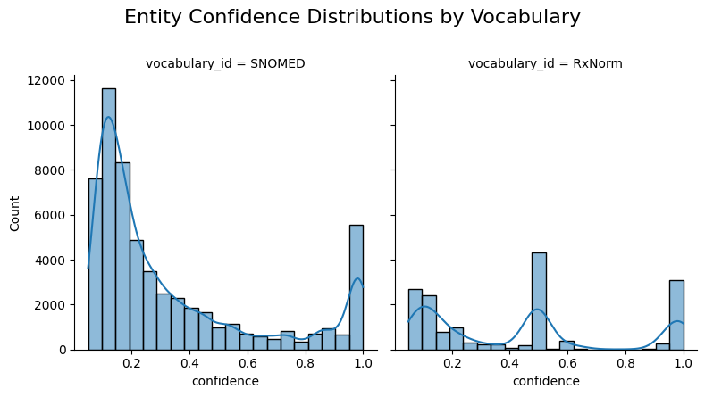
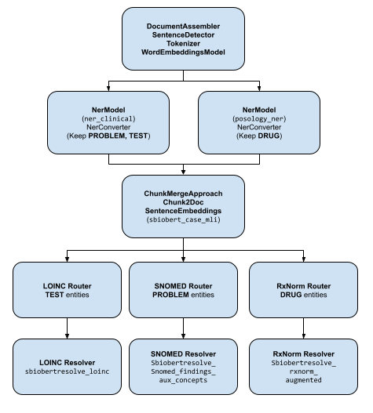

# JSL Task Solution

## Assigned Task

Convert 100 MIMIC III patients to the [OHDSI](https://ohdsi.org/) OMOP Common Data Model and consider the
implications of doing so.

## Overview

Conversion to OMOP involves two distinct activities: first, data should be
structure in the architecture of the
[OMOP Common Data Model](https://ohdsi.github.io/CommonDataModel/). Second,
information in the tables must be represented in standard vocabularies. The core
[standard vocabularies](https://ohdsi.github.io/TheBookOfOhdsi/StandardizedVocabularies.html)
in the OMOP system are:

* RxNorm for drugs and medications
* LOINC for measurements in the lab or other documents
* SNOMED-CT for virtually everything else

Building a complete CDM strictly from note text would be a significant struggle
because foundation information, such as the patient's identity, should be firmly
established before attaching extracted information to it.

In this document, I will describe a recommended approach of converting
structured data from the MIMIC III dataset to OMOP and then generating
NLP-Derived information to attach to it. The core *technical* challenges surround
correctly locating and recoding healthcare entities in text. The core
*business* challenge is determining what of this information can be trusted
and for what purposes.

This document will describe an overall approach, describe the OMOP CDM standard
tables and the NLP-related aspects of each, and then a potential workflow that
includes a Proof-of-Concept (POC) NLP pipeline that is a starting point.

At a very high level, the JSL models and pipelines are well-equipped to perform
the information extraction tasks we desire. Overall, any customer will require
validation of NLP results before accepting them in a dataset to be used for
their individual needs. Each subject area comes with some challenges that are
detailed further in the table-by-table discussion below.

## OMOP Conversion Principles

### Most Important: Stay Tuned to Client Goals

The fundamental reason for a database structured in OMOP CDM is to produce data
for observational research that can be pooled and shared with other
institutions. There are other reasons to do it, of course. OMOP is a helpful
meeting place when building a research data warehouse. Many cutting-edge
algorithms are published over data in OMOP form and these products can be put
into use easily if your data is already in this shape. Before we make any hard
decisions here, we would need to talk to the customer to understand their
reasons for the conversion and their goals.

Core tables such as`CONDITION` and `MEDICATION` are first and foremost intended
for defining cohorts and the consumers of this information must know the
provenance and trustworthiness of the data. NLP-derived information needs to be
a known quantity before adding it to core tables without an extensive
discussion.

Reasons for including NLP information include:

* adding patient conditions and information from a problem list stored as text
* identifying medications not stored in structured data
* adding information that is not present in the structured data (such as
  non-Alcohol Use Disorder levels of drinking)
* identifying other Social Determinants of Health
* (in the dentistry use case) indentifying all non-dental diagnoses and
  conditions because they appear nowhere else
* locating information about care providers missing in structured data
* adding family history

There is a lively conversation about whether data derived from an NLP process
should be used for cohort selection or outcomes. The standing compromise is that
any information inserted via NLP should have an appropriate flag in the
`source_concept_id` field for the table. Valid IDs are:

| concept_id | concept_name | domain_id | vocabulary_id |
|------------|--------------|-----------|---------------|
|    32858   |     NLP      | Type Concept |  Type Concept |
|    32423   | NLP derived  | Type Concept |  Meas Type    |
|    32445   | NLP derived  | Type Concept |  Observation Type |
|    32426   | NLP derived  | Type Concept |  Drug Type    |
|    32425   | NLP derived  | Type Concept |  Procedure Type |
|    32424   | NLP derived  | Type Concept |  Condition Type |

The rules we select for what should and should not be migrated from NLP derived
information must always go back to first principles: who wants this information,
and what do they want it for?

### Necessary Policy Decisions

* when does an NLP-derived value earn a place in the `NOTE_NLP` table?
  * I propose that nothing with __confidence below 0.95__ should come over.
    There's a marked spike at very high levels of confidence and no clear cutoff
    below that.



* when does an NLP-derived value earn a place in the __data__ table? Pending a
  customer's preferences, a good starting set of guidelines is:
  * Only entities with an Assertion of `Present` move
  * Entities move to the table associated with the mapped concept's Domain ID
  * Entities that move to tables must have an appropriate "NLP-Derived" `source_concept_id` associated
  * Entities aimed at `observation` require extra scrutiny for attribution to family, history, etc

### OMOP tables

This section describes each of the core OMOP CDM
[tables](https://ohdsi.github.io/CommonDataModel/cdm54.html) and how we can
approach them in the context of a conversion that includes NLP data.


#### Standardized Clinical Data

* `person` - information that should come solely from structured data. If our
  goal is to do a full conversion strictly from text, we can start to build out
  by using a
  [JSL tool](https://nlp.johnsnowlabs.com/2023/07/02/ner_sdoh_demographics_en.html)
  to extract key demographic data. There is real risk of entangling information
  about the patient's family in this information. A processing pipeline would have
  to include logic for rationalizing conflicting data.
* `death` - this is derived from the `admission` table when a value is present
  in `deathtime`. This should be derived from structured data.
* `visit_occurrence` - derived from `admission`. If relying strictly on text
  data, some clients might accept that a `visit_occurrence` was any contiguous
  block of days in which a note was written - but this is an imperfect assumption.
* `visit_detail` - a complex blend of `admission` and `transfer`, this describes
  a patient's specific encounters and transfers during a visit. The MIMIC III
  data does not bring over individual `provider` information, which is a pity,
  and may be a where NLP could fill in some information. If relying solely on
  text data, I would not be inclined to populate this table.
* `observation_period` - mapped from `mimiciii.admission`. It's important to
  remember that MIMIC III is a dataset derived from ICU care: patients in a more
  general health care system are going to have different types of encounter and
  this mapping will become more complex. It should be derived from structured
  data.
* `condition_occurrence` - the MIMIC III ETL brings over both Conditions and
  Observations from the `diagnoses_icd` table. An overwhelming majority of rows
  brought over did not map properly. (580,434/716,595): this is an ETL failure
  and needs to be fixed. Other data merged in comes from `adm_diag_cpt`.
  NLP-derived information that clearly maps to the `CONDITION` domain is a
  candidate for insertion.
  * The POC pipeline identifies only gross "Condition" or "Observation" values
    and does not do any relation mapping to connect them to parts of the body,
    severity, or other text modifiers. This is an important block of information
    and should be resolved before anything is carried over.
* `drug_exposure` - This is principally drawn from the `mimiciii.prescriptions`
  table. For NLP-derived information, the POC pipeline currently brings in only
  the name of a drug. We'd be better off adapting the `DrugNormalizer` model
  demo-ed in notebook 14.0 to identify complete collections of dose/form/etc.
  related information and standardize it before passing off to an RxNorm concept
  identifier.
* `procedure_occurrence` - The MIMIC III ETL did a fair-to-middling job bringing
  structured data over from `procedureevents_mv`. Additional NLP-derived values
  from the domain `Procedure` are good candidates. As before, the POC pipeline
  needs to be improved to collect text modifiers to concepts before sending a
  richer chunk to code mapping.
* `device_exposure` - The `ner_jsl` entity detection can label `Medical_Device`
  entities, and SNOMED-CT supports devices.
* `measurement` - The POC pipeline has a commented-out LOINC leg. It quickly
  became clear that simply extracting results without doing the relationship
  extraction between tests, results, and dates was producing nothing but noise.
  This data can be better extracted with some variant of the JSL
  `re_test_result_date` pipeline that then feeds off to code that does very
  careful handling to LOINC. Unlike RxNorm, where we can assemble
  drug/dose/frequency etc. into a single code, this information is a bad fit for
  `NOTE_NLP`. I think `NOTE_NLP` would have to take a record with the collection
  of test/result/unit etc. all stuffed into `term_modifiers` with their codes.
  ETL logic that transforms selected records to the `measurement` table would
  re-assemble concept IDs into a record.
* `observation` - Per OHDSI:

> "The OBSERVATION table captures clinical facts about a Person obtained in
> the context of examination, questioning or a procedure. Any data that
> cannot be represented by any other domains, such as social and lifestyle
> facts, medical history, family history, etc. are recorded here"

There is a clear-cut case for bringing over high-confidence entities in the
domain `Observation`, although the concept_classes of `Attribute` and
`Morph Abnormality` are of limited help without better relation extraction
binding them to their related concepts.

The JSL `Family` Assertion is being applied liberally to concepts that really
appear to belong to the patient - and at least in the version of the pipeline in
the POC, I can't force obvious family hx into text that reflects in the output.
I need to learn more about properly deriving and applying Assertions and
Relations before really committing information that isn't a straight up
Observation as far as OMOP Standard Concepts are concerned.

* `note` comes over from `mimiciii.noteevents`. A required field called
  `note_class_concept_id` is missing: According to
  [CDM 5.4](https://ohdsi.github.io/CommonDataModel/cdm54.html#note), it is "A
  Standard Concept Id representing the HL7 LOINC Document Type Vocabulary
  classification of the note." If the provenance of a Note is important
  information to the end consumer, the ETL will have to be amended to calculate
  and populate this column.

* `note_nlp` is a critical table for this work. Each row gets a specific concept
extracted by an NLP process, along with modifiers and metadata describing the
extraction process. In many OMOP communities, NLP-derived data stops here.
In the migration we envision for this paper, in which NLP-derived data is
destined for the main clinical tables, we need to store enough information to
support a final translation. (Primary amongst the information we've been working
with - the `measurement` table is a complex collection of information about both
a test and its results, and disentangling that information will require some
ETL logic.)

* `episode` is relatively new and designed for study of diseases that unfold
  over time. It and its companion `episode_event` are not populated.

* `specimen` is populated with nearly 40M entries for blood, urine, etc.
  samples, but 11M of them did not map to a specific concept. While more
  investigation is required, it may be possible to trace back to information in
  the NLP record

##### Standardized Health System

`Care Site` and `Provider` are included in the MIMIC III ETL, `Location` is not.
No data about physical address is available in the MIMIC III dataset. The JSL
models include a model in the Finance library that can extract addresses, but
it would be very difficult to know whether the presence of an address should be
attributed to a patient, a hospital location, or the site of a car crash. I am
inclined to leave this collection of information in the purview of a customer's
internal institutional knowledge.

##### Standardized Vocabularies

These tables were pulled from OHDSI's Athena: I selected common vocabularies I
work with all the time and stayed strictly with English-language resources. The
tables were built and indexed in a new schema adjacent to the MIMIC III data.
`source_to_concept_map` is an artifact of the structured data migration process
and is populated with hand mappings from source systems to the OMOP concepts.

##### Standardized Derived Elements

These are calculated by the ETL process from structured data after it is loaded
and are used to specify a span of time when a condition or a drug or a specific
dose was present in the patient. It allows cohort selection to select patients
who meet a criterion any time in the span of a `condition_era`, etc,
transforming many point-in-time data to a single range for searching.

If we bring many concepts for conditions or drugs over to the data set after
they are derived via NLP, these scripts should not be run until after the NLP
transfer is complete.

##### Standardized Health Economics

This information did not exist in OMOP CDM at the time the ETLs were created. No
cost/payment information exists in MIMIC III.

## Overall Migration Process

### Build Out an Empty CDM

I pulled a current set of standard concepts from Athena, and then executed OMOP CDM
build scripts to establish the vocabulary tables, load them, and index them.

### Use the MIMIC III - OMOP ETL scripts from the OHDSI team
  
ETL from MIMIC III is a (relatively) solved problem and the structured data and
notes can be carried over with code such as that available at MIT's
[MIMIC-OMOP](https://github.com/MIT-LCP/mimic-omop) repo. That repo is at least
six years old and has fallen out of sync with current versions of CDM. The ETL
scripts needed to be tweaked to run at all. As noted above, some transforms were
unsatisfactory: thorough testing and revision is required for any production
use.
  
### Proof-of-Concept JSL Pipeline

This is in the [pipeline_experiments.ipynb](pipeline_experiments.ipynb) Jupyter notebeook.
It is an adaptation of demonstration pipelines in the JSL Jupyter Notebooks. I
would like to refine it to ensure that information is calculated efficiently (and
not repeatedly).

* I chose to use `ner-jsl` but am concerned about properly filtering entity types
* I Routers to send true `DRUG` information over to an RxNorm resolver, and
  just about everything else to a SNOMED-CT Observation resolver
* Early experiments with `TEST`s were unsatisfactory, as all kinds of acronyms
  were getting context-less entity matches. I want to handle test information
  more carefully with relationship matching between tests, values, and units.
  Something like the drug normalizer might be the best starting point.
* We collect simple assertions about each entity as it's being located, and the
  confidence. This initial pass has produced results that need review.

The diagram below is a rough view of a draft of the pipeline, although it's been
constantly tweaked since.



The pipeline is modeled heavily after a lot of the JSL demo code and I'm
grateful for that help. It needs relationship extraction, handling of tests and
results, and potentially more finely-grained entity -> code mapping.

### Note Parsing

Because we're only handling 100 patients' notes, I collect the notes in one SQL
query and then, in batches, put them through the pipeline, extract fundamental
concepts and attributes from the annotation process, and send them to my
Postgres database in a temporary holding table. I would very much like to learn
more about effectively streaming from database through the pipeline and back to
the database without this constant load/unload cycle.

The output table should be thoroughly indexed before moving to the next step.

### Quality Assessment

The migration analyst must perform extensive exploratory analysis of the results
with the client to understand the distribution of information being extracted
and its quality. Manual chart review may be required by clients to ensure that
the extracted data is of high enough quality to move. The outcome of this assessment
may be improvements to the NLP pipeline, or a post-NLP filter (or both)

### Filtering and Preparing for NOTE_NLP

Some annotations shouldn't even go to the `note_nlp` table at all. I think
anything with a low confidence value should not. Since `note_nlp` does make
allowances for negation and other assertions, though, if the client wants it,
entities that are negated or tied to family (etc) can be move to `note_nlp`.
This is a SQL query that could generate new rows for `note_nlp`:

```sql
SELECT e.note_id,
       concept_name, -- we don't need this for the final transform but it's helpful for a sanity check
       e.confidence, -- likewise, this doesn't come over but is helpful information while troubleshooting
       e.chunks                                               as snippet,
       e.begin                                                as offset,
       concept_id                                             as note_nlp_concept_id,
       e.code                                                 as note_nlp_source_concept_id,
       'JSL spark-nlp'                                        as nlp_system,
       '2024-06-25'                                           as nlp_date,
       case when e.assertion = 'Present' then 1 else 0 end    as term_exists,
       case when e.assertion = 'Past' then 'Past' else '' end as term_temporal,
       e.assertion                                            as term_modifiers,
       concept_code                                           as code,
       domain_id,
       c.vocabulary_id,
       concept_class_id
       
from omop.concept c
         inner join omop.TMP_EXTRACTED_CODES_BAK e
                    on e.code = c.concept_code and e.vocabulary_id = c.vocabulary_id
where c.domain_id in ('Measurement', 'Drug', 'Condition', 'Observation', 'Procedure')
  and not concept_class_id in ('Attribute', 'Morph Abnormality')
  and e.confidence >= 0.95
  and invalid_reason is NULL;
```

### Migration of NOTE_NLP data to Standard Concept Tables

This has to be considered extremely carefully, working with the customer hand-in-hand the
whole way. The risk of moving NLP data to standard tables can be viewed on two axes:

1) What is the __probability__ that we will put incorrect data in the table?
2) What is the __cost__ of putting incorrect data in the table?

This information may vary from table to table, and the decision about it
may also vary.

The __probability__ of error should be assessed first internally, and then with
the client by hand-reviewing the inference results over a selection of random records.
The __cost__ of error is entirely in the decision space of the client. Noting the use
of a wheelchair by a patient when it's really the patient's mother may be trivial
in a dataset that will be used to study cancer. It will be a completely different
matter if the customer is interested in studying falls.

Another approach to managing error would be to algorithmically compare NLP-derived
information to structured data from the same visit and closely inspect records
where they are contradictory. We hope NLP will add missing data - but if there
is an outright conflict in information, we should investigate.

## Conclusion

Many aspects of the data stored in the OMOP CDM can be obtained from clinical
notes, but the extracted data is more trustworthy and meaningful when blended
with structured data during the ETL. JSL tools are able to collect key
information from clinical notes for addition to the OMOP `NOTE_NLP` table. Rules
for what information in this table might migrate to the core clinical concept
tables must be developed with the client, bearing in mind their end purpose.
